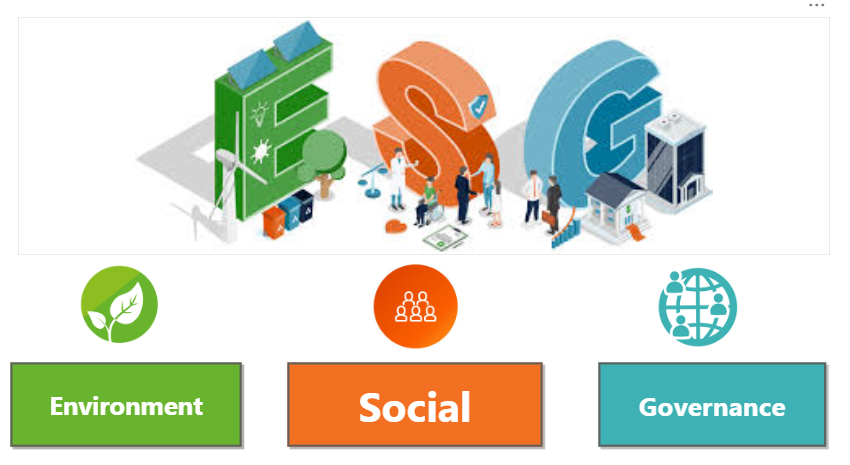
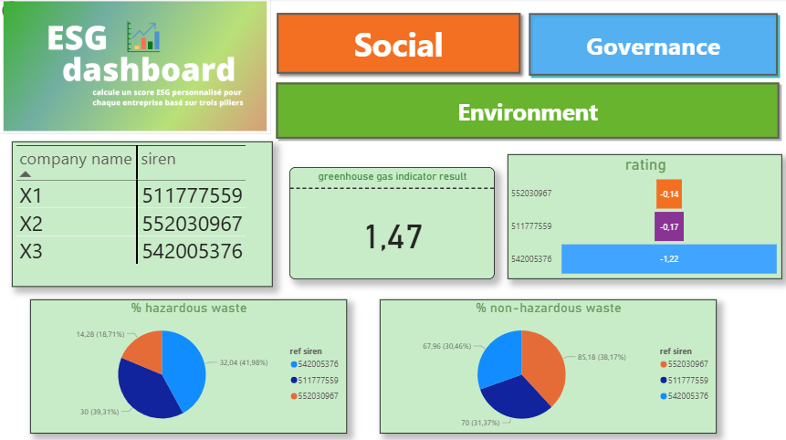
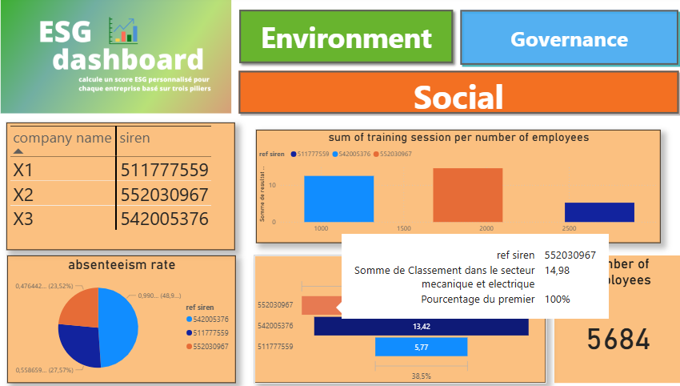
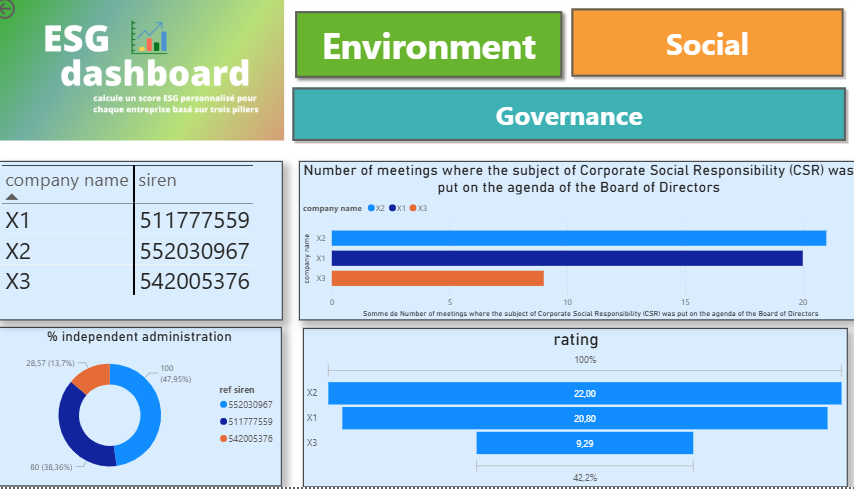

<h1 align="center">📊 ESG Indicators Dashboard for Anonymous Company Rankings</h1>

  
  
  
  

---

<h2>Description</h2>

This project presents an interactive ESG (Environmental, Social, Governance) Indicators Dashboard for anonymous company rankings. The dashboard allows users to select a sector (Electrical, Mechanical) and navigate through environmental, social, and governance indicators for performance analysis. Each KPI is visualized with rankings and ratings, providing actionable insights for sustainability and corporate responsibility evaluation.

<h2>Dashboard Pages</h2>

<h3>1. Sector Selection Page</h3>

   
  <em>User chooses the sector (Electrical, Mechanical, etc.) to analyze.</em>

<h3>2. Home Page (ESG Pillar Selection)</h3>

   
  <em>Select the ESG pillar: Environmental, Social, or Governance.</em>

<h3>3. Environmental Page</h3>

   
  <em>
    KPIs displayed:  
    • Greenhouse Gas Indicator  
    • % Non-Hazardous Waste  
    • % Hazardous Waste  
    • Rating and Ranking
  </em>

<h3>4. Social Page</h3>

   
  <em>
    KPIs displayed:  
    • Sum of Training Sessions per Number of Employees  
    • Number of Employees  
    • Absenteeism Rate  
    • Rating and Ranking
  </em>

<h3>5. Governance Page</h3>

   
  <em>
    KPIs displayed:  
    • Number of meetings where CSR was on board agenda  
    • % Independent Administration  
    • Rating and Ranking
  </em>

---

<h2>Features</h2>
<ul>
  <li>Interactive dashboard for ESG performance by sector</li>
  <li>Visual analysis of Environmental, Social, and Governance KPIs</li>
  <li>Ratings and ranking comparisons across companies</li>
  <li>Dynamic selection of sector and ESG pillar</li>
</ul>
